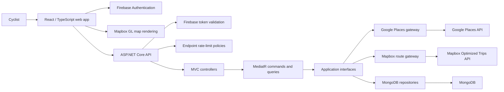
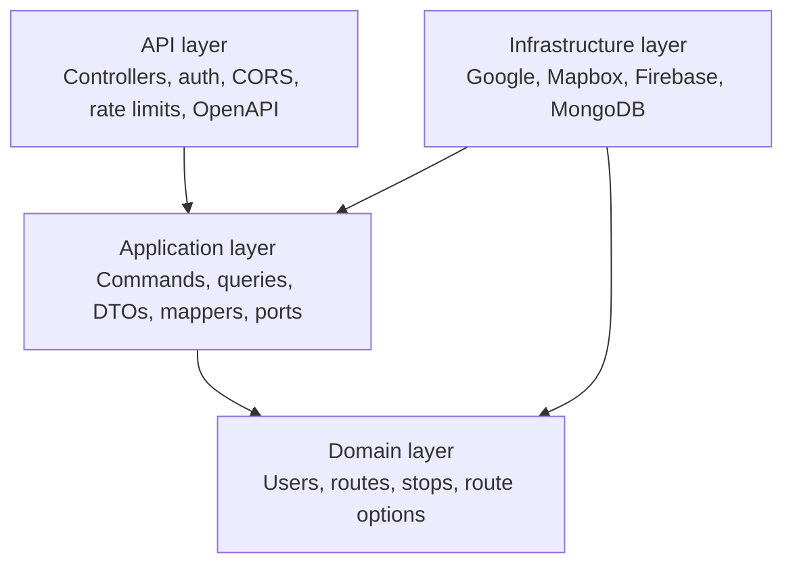
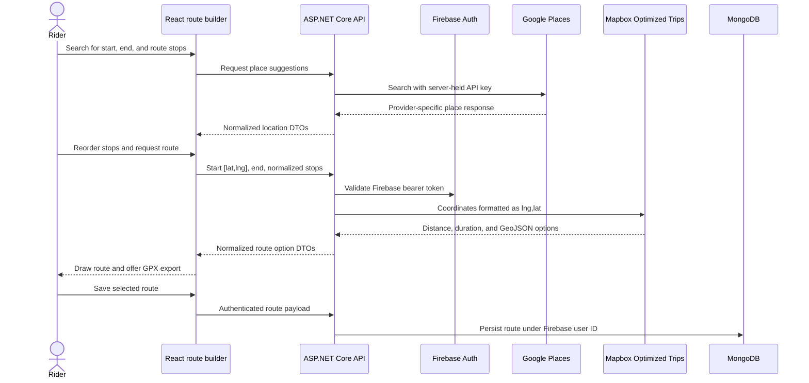
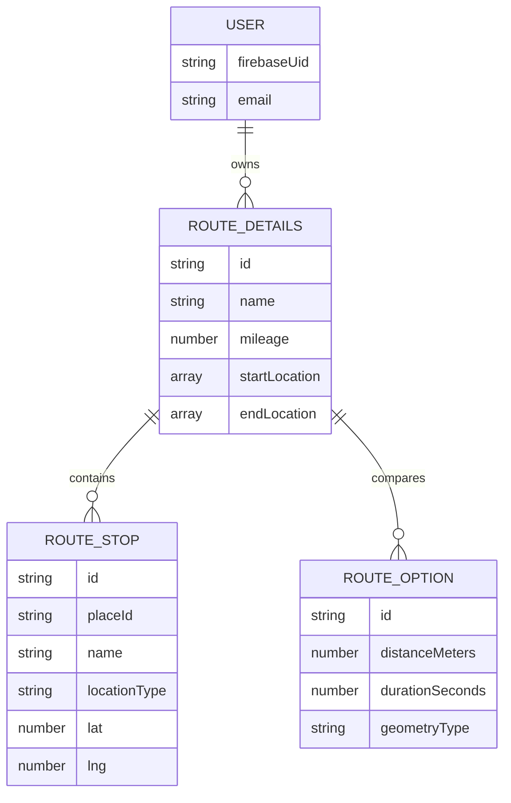

# Bike2Beans — Full-Stack Cycling Route Planner

Bike2Beans helps cyclists build a route around the places they actually want to visit. A rider can search for coffee shops or other destinations, arrange multiple stops, generate cycling route options, view the result on a map, save authenticated routes, and export a selected route as GPX.

The core engineering challenge is integration, not drawing a line on a map: Google Places and Mapbox use different request models, coordinate ordering, identifiers, response shapes, and failure behavior. Bike2Beans normalizes those boundaries behind a React/TypeScript client and a layered ASP.NET Core API.

## Quick facts

| | |
|---|---|
| **Project type** | Full-stack web application with shared React Native foundations |
| **Frontend** | React, TypeScript, Webpack, React Native Web, Mapbox GL |
| **Backend** | C#, ASP.NET Core 9, MediatR, Swagger/OpenAPI |
| **Data and auth** | MongoDB, Firebase Authentication |
| **External APIs** | Google Places, Mapbox Optimized Trips |
| **Verification** | 34 .NET tests and 4 Jest tests in the repository |
| **Deployment** | Separate Railway web and API services |

## The problem

General-purpose map tools can find a destination or calculate a route, but they do not make it easy to design a cycling trip around several coffee and non-coffee stops, reorder those stops, compare route options, save the plan, and export it to another navigation device.

Bike2Beans brings that workflow together while keeping paid external APIs behind a rate-limited backend and tying saved data to the authenticated Firebase user.

## What the application does

- Searches Google Places for coffee shops and general destinations.
- Supports coffee and non-coffee route stops through one internal stop model.
- Lets the rider reorder multiple stops before requesting a route.
- Handles a fixed end point or a round trip back to the start.
- Requests cycling-optimized route options from Mapbox.
- Draws the returned GeoJSON route and lets the rider switch among alternatives.
- Exports the selected route as a GPX file.
- Saves and retrieves routes for the authenticated user.
- Applies endpoint-specific rate limits to cost-bearing Places and route-generation calls.
- Exposes Swagger/OpenAPI in development and health checks for deployment.

## System architecture



## Layered backend design



The application layer depends on interfaces such as `IRouteProvider`, `ILocationProvider`, and repository ports. Provider-specific code stays in Infrastructure, which keeps Google, Mapbox, Firebase, and MongoDB details out of the route-planning workflow.

## Route-generation flow



## The data-shape problem

The hardest integration bug was not a complex algorithm; it was keeping location data consistent across systems that disagree about shape and ordering.

| Boundary | Shape |
|---|---|
| UI and application state | `lat`, `lng` named fields and `[lat, lng]` location arrays |
| Google Places | Nested place/location response normalized into application DTOs |
| Mapbox route URL | Semicolon-separated `lng,lat` coordinate pairs |
| Mapbox response | Route geometry coordinates already represented as `lng,lat` |
| Saved route | Domain-owned route and stop records independent of provider response objects |

The Mapbox gateway performs the coordinate reordering once at the provider boundary. The UI converts coffee and custom destinations into the same `RouteStopDto` before route generation.

## Core domain relationships



## Reliability and cost controls

- Firebase bearer tokens are validated server-side before user-route operations.
- Saved routes are scoped to the authenticated Firebase UID rather than a client-provided user ID.
- CORS origins are explicit and configurable per environment.
- Cost-bearing Places and route-generation endpoints use fixed-window rate-limit policies.
- External-provider failures are surfaced to the UI as route/search failures rather than silently returning bad geometry.
- GPX export is generated directly from validated route coordinates, avoiding the legacy XML dependency previously used for conversion.
- Production builds fail when required frontend API or Mapbox configuration is missing.
- Web and API services expose health checks for Railway.

## Testing

The repository contains focused application and API integration coverage plus frontend unit tests.

| Suite | Coverage focus | Tests |
|---|---|---:|
| `Bike2Beans/Application.Tests` | Handlers, mapping, route generation, user and coffee-shop behavior | 12 |
| `Bike2Beans/Api.IntegrationTests` | Controllers, auth boundaries, Places/Mapbox gateway behavior | 22 |
| `Bike2BeansUI` Jest suite | API client and frontend behavior | 4 |
| **Total** | | **38** |

Run the backend tests:

```bash
dotnet test Bike2Beans/Bike2Beans.sln
```

Run the frontend tests:

```bash
npm ci --prefix Bike2BeansUI
npm test --prefix Bike2BeansUI -- --runInBand
```

## Run locally

### Requirements

- .NET 9 SDK
- Node.js 20 or newer
- MongoDB
- Firebase project and Admin SDK credentials
- Google Places API key
- Mapbox public and server access tokens

### 1. Configure the API

Use environment variables or .NET user secrets for:

```text
FIREBASE_PROJECT_ID
FIREBASE_ADMIN_SERVICE_ACCOUNT_JSON
GOOGLE_PLACES_API_KEY
MAPBOX_ACCESS_TOKEN
MongoDBSettings__ConnectionString
MongoDBSettings__DatabaseName
CORS_ALLOWED_ORIGINS
```

Start the API:

```bash
dotnet run --project Bike2Beans/Api
```

### 2. Configure the web client

Copy `Bike2BeansUI/.env.example` to `Bike2BeansUI/.env` and set:

```text
API_BASE_URL=http://localhost:5165
MAPBOX_ACCESS_TOKEN=your_public_mapbox_token
```

Start the web app:

```bash
npm install
npm run dev
```

Detailed production settings and failure modes are documented in [`docs/production.md`](docs/production.md).

## Repository map

```text
Bike2Beans/Api                 HTTP, auth, CORS, rate limits, OpenAPI
Bike2Beans/Application         Commands, queries, DTOs, mappers, interfaces
Bike2Beans/Domain              Core route, stop, option, and user entities
Bike2Beans/Infrastructure      Google, Mapbox, Firebase, and MongoDB adapters
Bike2Beans/Application.Tests   Application tests
Bike2Beans/Api.IntegrationTests API and gateway integration tests
Bike2BeansUI                   React/TypeScript web and React Native foundations
docs/production.md             Railway configuration and deployment debugging
```

## Known limitations and next steps

- The public hosted site still needs final production hardening and UX validation.
- Provider error responses can be mapped into more specific user recovery guidance.
- Observability should add structured logs and trace IDs across browser, API, and provider calls.
- The React Native toolchain needs a planned major-version upgrade to clear the remaining high-severity transitive npm advisories; the legacy GPX dependency and its critical XML advisory have been removed.
- Saved-route sharing and collaborative trip planning are not implemented.
- Native iOS/Android surfaces exist as foundations but are less complete than the web workflow.

## What this project demonstrates

- Translating incompatible external data models into stable application contracts.
- Designing a layered C# service around ports, adapters, commands, and queries.
- Debugging authenticated workflows across React, ASP.NET Core, Firebase, MongoDB, Google, and Mapbox.
- Treating deployment configuration, rate limits, tests, and recovery behavior as part of the product.
